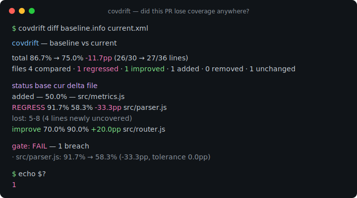
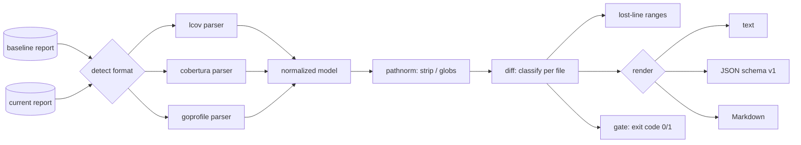

# covdrift

[English](README.md) | [中文](README.zh.md) | [日本語](README.ja.md)

[](LICENSE) [](go.mod) [](CHANGELOG.md)  [](CONTRIBUTING.md)

**covdrift：2 つのカバレッジレポートを diff し、ファイル単位のリグレッションで CI を落とすオープンソース・ゼロ依存 CLI——lcov・cobertura・Go coverprofile を横断するフォーマット非依存、カバレッジサービス不要。**



```bash
git clone https://github.com/JaydenCJ/covdrift && cd covdrift
go build -o covdrift ./cmd/covdrift    # single static binary, stdlib only
```

> プレリリース：v0.1.0 はまだどのパッケージレジストリにも公開されていません。上記の通りソースからビルドしてください（Go ≥1.22 であれば可）。

## なぜ covdrift？

グローバルなカバレッジ閾値は、間違った相手を罰します。基準を 80% に置くと、ブロックされるのは他人の未テストコードが平均値を押し下げた瞬間にたまたま開いていた PR——一方で、重要ファイルのテストを骨抜きにする変更は、ほとんど動かないリポジトリ全体の数字の中に隠れて素通りします。実行同士を比較してくれるツールはどれもカバレッジ*サービス*です：ホスティングされたプラットフォーム、リポジトリの token、アップロード手順、そして exit code との間に挟まるコメントボット。covdrift は欠けていた小さな部品です：main ブランチのベースラインレポートとこの PR のレポートを読み——片側が lcov、もう片側が cobertura や Go coverprofile という異なるフォーマットでも——各ファイルを*それ自身の*ベースラインと比較し、どの行がカバレッジを失ったかを正確に出力して exit 1 する、単一の静的バイナリ。サービスも token も不要、YAML はそのコマンド 1 行だけ。

| | covdrift | ホスト型カバレッジサービス | `go tool cover` / lcov 集計 | テストランナーの閾値フラグ |
|---|---|---|---|---|
| ベースライン実行とのファイル単位 diff | ✅ | ✅ | ❌ 単一実行のみ | ❌ 絶対閾値 |
| オフラインで動作、token もアップロードも不要 | ✅ | ❌ SaaS | ✅ | ✅ |
| 1 回の diff で入力フォーマット混在 | ✅ lcov + cobertura + goprofile | 部分的 | ❌ 単一フォーマット | ❌ 独自フォーマット |
| 新たに未カバーになった行を名指し | ✅ | 部分的 | ❌ | ❌ |
| CI の判定が素の exit code | ✅ | ❌ API/checks 経由 | ❌ | ✅ |
| ランタイム依存 | 0 | 該当なし | 0（組み込み） | ランナーに同梱 |

<sub>依存数は 2026-07-13 に確認：covdrift が import するのは Go 標準ライブラリのみ。</sub>

## 特長

- **絶対閾値ではなく diff ベースのゲート** — 各ファイルは自身のベースラインと比較され、PR は*自分が*失ったカバレッジでしか落ちません。他人の負債があなたのマージを塞ぐことはありません。
- **内容スニッフィングによるフォーマット非依存** — lcov トレースファイル、cobertura XML、Go coverprofile を単一モデルに正規化。diff の両側は異なるフォーマットでもよく、ファイルごとに自動検出されます。
- **失われた行の証拠** — リグレッションしたファイルには、以前カバーされ今は未カバーの正確な行レンジ（`lost: 5-8`）が付き、レビュアーは欠落箇所へ直行できます。
- **チームの実態に合う許容値** — ファイル単位の `--tolerance`（ポイント）、`--total-tolerance` の総予算、4 行のファイルが 25pp 揺れるのを防ぐ `--min-lines`、新規ファイルにカバレッジを要求する `--min-new`。
- **3 つの出力、1 つの判定** — 整列済みターミナルテキスト、安定 JSON（`schema_version: 1`）、PR コメントにそのまま貼れる Markdown。exit code 0/1/2/3 で、ゲートはどの CI でも 1 行になります。
- **パス調停を内蔵** — `--strip-prefix`、スラッシュ正規化、`**` glob により、あるマシンの絶対 lcov パスと別のマシンの相対 cobertura パスが揃います。
- **ゼロ依存・完全オフライン** — Go 標準ライブラリのみ。covdrift はローカルの 2 ファイルを読み stdout に書くだけ。サービスなし、テレメトリなし、ネットワークは一切使いません。

## クイックスタート

```bash
# a baseline from your main branch (lcov) vs this PR's run (cobertura)
covdrift diff examples/baseline.info examples/current.xml
```

実際にキャプチャした出力（exit code 1）：

```text
covdrift — baseline vs current

total    86.7% → 75.0%  -11.7pp  (26/30 → 27/36 lines)
files    4 compared · 1 regressed · 1 improved · 1 added · 0 removed · 1 unchanged

status       base     cur     delta  file
added           —   50.0%         —  src/metrics.js
REGRESS     91.7%   58.3%   -33.3pp  src/parser.js
            lost: 5-8  (4 lines newly uncovered)
improve     70.0%   90.0%   +20.0pp  src/router.js

gate: FAIL — 1 breach
  · src/parser.js: 91.7% → 58.3% (-33.3pp, tolerance 0.0pp)
```

PR の会話用に、同じ diff の Markdown 版（`--format markdown`、実出力）：

```text
### covdrift: ❌ coverage gate failed

**Total:** 86.7% → 75.0% (-11.7pp) · 1 regressed · 1 improved · 1 added · 0 removed

| File | Baseline | Current | Δ | Status |
|---|---:|---:|---:|---|
| `src/metrics.js` | — | 50.0% | — | added |
| `src/parser.js` | 91.7% | 58.3% | -33.3pp | **regressed** |
| `src/router.js` | 70.0% | 90.0% | +20.0pp | improved |

`src/parser.js` — newly uncovered lines: 5-8

- ⚠️ src/parser.js: 91.7% → 58.3% (-33.3pp, tolerance 0.0pp)
```

## CLI リファレンス

`covdrift [diff|show|version] [flags] <paths>` — 素のパス 2 つは `diff` として扱われます。exit code：0 正常、1 ゲート違反、2 使用法エラー、3 実行時エラー。入力フォーマットと正規化ルールは [docs/formats.md](docs/formats.md) を参照。

| フラグ | 既定値 | 効果 |
|---|---|---|
| `--format` | `text` | `text`・`json`・`markdown`（`show`：`text`/`json`） |
| `--tolerance` | `0` | 許容するファイル単位の低下幅（ポイント） |
| `--total-tolerance` | オフ | 全体のカバレッジ変化にもゲートを掛ける |
| `--min-new` | オフ | 新規ファイルに最低このパーセントのカバレッジを要求 |
| `--min-lines` | `0` | 計測行数がこれ未満のファイルはゲート対象外 |
| `--no-gate` | オフ | レポートのみ。リグレッションがあっても exit 0 |
| `--all` | オフ | 変化のないファイルも一覧に含める |
| `--input-format` | `auto` | `lcov`・`cobertura`・`goprofile` を強制 |
| `--strip-prefix` | — | 突き合わせ前にパス接頭辞を除去（繰り返し可） |
| `--include` / `--exclude` | — | glob フィルタ、例：`'vendor/**'`（繰り返し可） |

## ベースラインの用意

covdrift は意図的にストレージを持ちません：ベースラインはただのファイルで、ファイルの保管なら CI がすでに得意です。main ブランチの各ビルドのカバレッジレポートをビルドアーティファクト（またはブランチをキーにしたキャッシュ）として保存し、PR ジョブの冒頭でダウンロードして diff してください。`covdrift diff` は空・初回のベースラインも穏当に扱います——全ファイルが `added` と表示され、`--min-new` を設定しない限りゲートは発動しません。許容値と除外を備えた完全なゲートは [examples/pr-gate.sh](examples/pr-gate.sh) を参照。

## 検証

このリポジトリは CI を同梱しません。上記の主張はすべてローカル実行で検証されます：

```bash
go test ./...            # 90 deterministic tests, offline, < 5 s
bash scripts/smoke.sh    # end-to-end CLI check, prints SMOKE OK
```

## アーキテクチャ



## ロードマップ

- [x] v0.1.0 — 自動検出付き lcov/cobertura/goprofile 解析、許容値付きファイル単位 diff ゲート、失われた行レンジ、text/JSON/Markdown 出力、パス調停、90 テスト + smoke スクリプト
- [ ] JaCoCo XML と Clover の入力パーサー
- [ ] 行カバレッジに加えたブランチカバレッジの diff
- [ ] PR が触れたファイルだけをゲートする `--against-changed` モード（stdin から diff を読む）
- [ ] シャード化テスト向けのベースライン自動マージ（`covdrift merge shard1.info shard2.xml`）
- [ ] 失われた行の前後を並べて見せる HTML レポート

全リストは [open issues](https://github.com/JaydenCJ/covdrift/issues) を参照。

## コントリビュート

issue・ディスカッション・PR を歓迎します——ローカルのワークフロー（フォーマット、vet、テスト、`SMOKE OK`）は [CONTRIBUTING.md](CONTRIBUTING.md) を参照。入門タスクは [good first issue](https://github.com/JaydenCJ/covdrift/issues?q=is%3Aissue+is%3Aopen+label%3A%22good+first+issue%22) のラベル付き、設計の議論は [Discussions](https://github.com/JaydenCJ/covdrift/discussions) で。

## ライセンス

[MIT](LICENSE)
