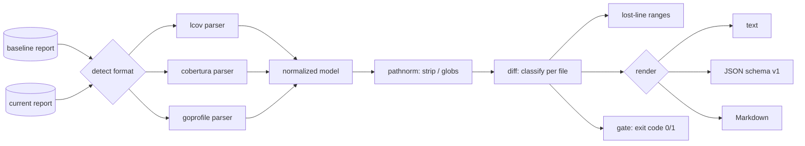

# covdrift

[English](README.md) | [中文](README.zh.md) | [日本語](README.ja.md)

[](LICENSE) [](go.mod) [](CHANGELOG.md)  [](CONTRIBUTING.md)

**covdrift：an open-source, zero-dependency CLI that diffs two coverage reports and fails CI on per-file regressions — format-agnostic across lcov, cobertura, and Go coverprofiles, no coverage service required.**


```bash
git clone https://github.com/JaydenCJ/covdrift && cd covdrift
go build -o covdrift ./cmd/covdrift    # single static binary, stdlib only
```

> Pre-release: v0.1.0 is not tagged on a package registry yet; build from source as above (any Go ≥1.22).

## Why covdrift?

Global coverage thresholds punish the wrong people. Set the bar at 80% and the PR that gets blocked is whichever one happens to be open when someone else's untested code tips the average — while a change that guts the tests of one critical file sails through, hidden inside a repo-wide number that barely moved. The tools that do compare runs against each other are coverage *services*: a hosted platform, a repo token, an upload step, and a comment bot between you and an exit code. covdrift is the missing small piece: a single static binary that reads the baseline report from your main branch and the report from this PR — even in two different formats, lcov on one side and cobertura or a Go coverprofile on the other — compares every file against *its own* baseline, prints exactly which lines lost coverage, and exits 1. No service, no token, no YAML beyond the one command.

| | covdrift | hosted coverage services | `go tool cover` / lcov summary | threshold flags in test runners |
|---|---|---|---|---|
| Per-file diff against a baseline run | ✅ | ✅ | ❌ single run only | ❌ absolute thresholds |
| Works offline, no token or upload | ✅ | ❌ SaaS | ✅ | ✅ |
| Mixed input formats in one diff | ✅ lcov + cobertura + goprofile | partial | ❌ one format | ❌ own format |
| Names the exact newly-uncovered lines | ✅ | partial | ❌ | ❌ |
| CI verdict as a plain exit code | ✅ | ❌ via API/checks | ❌ | ✅ |
| Runtime dependencies | 0 | n/a | 0 (built-in) | bundled with runner |

<sub>Dependency counts checked 2026-07-13: covdrift imports the Go standard library only.</sub>

## Features

- **Diff-aware gating, not absolute thresholds** — every file is compared against its own baseline, so a PR only fails for coverage *it* lost; other people's debt never blocks your merge.
- **Format-agnostic by content sniffing** — lcov tracefiles, cobertura XML, and Go coverprofiles are normalized into one model; the two sides of a diff may use different formats, detected per file.
- **Lost-line evidence** — regressed files come with the exact line ranges that were covered before and are uncovered now (`lost: 5-8`), so reviewers jump straight to the gap.
- **Tolerances that match how teams actually work** — per-file `--tolerance` in percentage points, a `--total-tolerance` budget, `--min-lines` to keep 4-line files from swinging 25pp, and `--min-new` to require coverage on brand-new files.
- **Three outputs, one verdict** — aligned terminal text, stable JSON (`schema_version: 1`), and PR-comment-ready Markdown; exit codes 0/1/2/3 make the gate a one-liner in any CI system.
- **Path reconciliation built in** — `--strip-prefix`, slash canonicalization, and `**` globs line up absolute lcov paths from one machine with relative cobertura paths from another.
- **Zero dependencies, fully offline** — Go standard library only; covdrift reads two local files and writes to stdout. No service, no telemetry, no network, ever.

## Quickstart

```bash
# a baseline from your main branch (lcov) vs this PR's run (cobertura)
covdrift diff examples/baseline.info examples/current.xml
```

Real captured output (exit code 1):

```text
covdrift — baseline vs current

total    86.7% → 75.0%  -11.7pp  (26/30 → 27/36 lines)
files    4 compared · 1 regressed · 1 improved · 1 added · 0 removed · 1 unchanged

status       base     cur     delta  file
added           —   50.0%         —  src/metrics.js
REGRESS     91.7%   58.3%   -33.3pp  src/parser.js
            lost: 5-8  (4 lines newly uncovered)
improve     70.0%   90.0%   +20.0pp  src/router.js

gate: FAIL — 1 breach
  · src/parser.js: 91.7% → 58.3% (-33.3pp, tolerance 0.0pp)
```

For the PR conversation, the same diff as Markdown (`--format markdown`, real output):

```text
### covdrift: ❌ coverage gate failed

**Total:** 86.7% → 75.0% (-11.7pp) · 1 regressed · 1 improved · 1 added · 0 removed

| File | Baseline | Current | Δ | Status |
|---|---:|---:|---:|---|
| `src/metrics.js` | — | 50.0% | — | added |
| `src/parser.js` | 91.7% | 58.3% | -33.3pp | **regressed** |
| `src/router.js` | 70.0% | 90.0% | +20.0pp | improved |

`src/parser.js` — newly uncovered lines: 5-8

- ⚠️ src/parser.js: 91.7% → 58.3% (-33.3pp, tolerance 0.0pp)
```

## CLI reference

`covdrift [diff|show|version] [flags] <paths>` — two bare paths default to `diff`. Exit codes: 0 ok, 1 gate breach, 2 usage error, 3 runtime error. Input formats and normalization rules are documented in [docs/formats.md](docs/formats.md).

| Flag | Default | Effect |
|---|---|---|
| `--format` | `text` | `text`, `json`, or `markdown` (`show`: `text`/`json`) |
| `--tolerance` | `0` | allowed per-file drop in percentage points |
| `--total-tolerance` | off | also gate the overall coverage delta |
| `--min-new` | off | require new files to be covered at least this percent |
| `--min-lines` | `0` | files with fewer instrumented lines never gate |
| `--no-gate` | off | report only; exit 0 even on regressions |
| `--all` | off | list unchanged files too |
| `--input-format` | `auto` | force `lcov`, `cobertura`, or `goprofile` |
| `--strip-prefix` | — | remove a path prefix before matching (repeatable) |
| `--include` / `--exclude` | — | glob filters, e.g. `'vendor/**'` (repeatable) |

## Getting a baseline

covdrift deliberately has no storage: the baseline is just a file, and your CI already knows how to keep files. Save the coverage report of every main-branch build as a build artifact (or a cache entry keyed by branch), download it at the start of the PR job, and diff against it. `covdrift diff` treats an empty or first-time baseline gracefully — every file shows as `added`, and nothing gates unless you set `--min-new`. See [examples/pr-gate.sh](examples/pr-gate.sh) for a complete gate with tolerances and excludes.

## Verification

This repository ships no CI; every claim above is verified by local runs:

```bash
go test ./...            # 90 deterministic tests, offline, < 5 s
bash scripts/smoke.sh    # end-to-end CLI check, prints SMOKE OK
```

## Architecture



## Roadmap

- [x] v0.1.0 — lcov/cobertura/goprofile parsing with auto-detection, per-file diff gating with tolerances, lost-line ranges, text/JSON/Markdown output, path reconciliation, 90 tests + smoke script
- [ ] JaCoCo XML and Clover input parsers
- [ ] Branch-coverage diffing alongside line coverage
- [ ] `--against-changed` mode gating only files touched by the PR (reads a diff from stdin)
- [ ] Baseline auto-merge (`covdrift merge shard1.info shard2.xml`) for sharded test suites
- [ ] HTML report with side-by-side lost-line context

See the [open issues](https://github.com/JaydenCJ/covdrift/issues) for the full list.

## Contributing

Issues, discussions and pull requests are welcome — see [CONTRIBUTING.md](CONTRIBUTING.md) for the local workflow (format, vet, tests, `SMOKE OK`). Good entry points are labelled [good first issue](https://github.com/JaydenCJ/covdrift/issues?q=is%3Aissue+is%3Aopen+label%3A%22good+first+issue%22), and design questions live in [Discussions](https://github.com/JaydenCJ/covdrift/discussions).

## License

[MIT](LICENSE)
