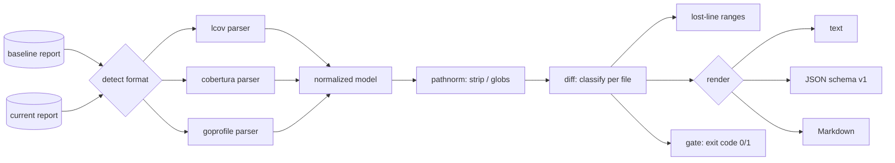

# covdrift

[English](README.md) | [中文](README.zh.md) | [日本語](README.ja.md)

[](LICENSE) [](go.mod) [](CHANGELOG.md)  [](CONTRIBUTING.md)

**covdrift：开源、零依赖的 CLI，对比两份覆盖率报告并在出现按文件回归时让 CI 失败——格式无关，通吃 lcov、cobertura 和 Go coverprofile，无需任何覆盖率服务。**


```bash
git clone https://github.com/JaydenCJ/covdrift && cd covdrift
go build -o covdrift ./cmd/covdrift    # single static binary, stdlib only
```

> 预发布：v0.1.0 尚未发布到任何包注册表；请按上述方式从源码构建（任何 Go ≥1.22 均可）。

## 为什么选 covdrift？

全局覆盖率阈值惩罚的是错误的人。把门槛设在 80%，被卡住的往往是别人未测试的代码把平均值压过线时恰好开着的那个 PR——而真正把某个关键文件的测试掏空的改动，却藏在几乎没动的仓库整体数字里畅通无阻。真正做「运行之间互相对比」的工具都是覆盖率*服务*：托管平台、仓库 token、上传步骤，还有横在你和退出码之间的评论机器人。covdrift 就是缺失的那块小零件：一个静态单二进制，读取主分支的基线报告和这个 PR 的报告——哪怕两边格式不同，一边 lcov、另一边 cobertura 或 Go coverprofile——把每个文件与*它自己的*基线对比，精确打印哪些行失去了覆盖，然后 exit 1。没有服务、没有 token，除了那一条命令没有多余的 YAML。

| | covdrift | 托管覆盖率服务 | `go tool cover` / lcov 汇总 | 测试运行器的阈值参数 |
|---|---|---|---|---|
| 按文件与基线运行做 diff | ✅ | ✅ | ❌ 只看单次运行 | ❌ 绝对阈值 |
| 离线可用，无 token 无上传 | ✅ | ❌ SaaS | ✅ | ✅ |
| 一次 diff 混用多种输入格式 | ✅ lcov + cobertura + goprofile | 部分支持 | ❌ 单一格式 | ❌ 自有格式 |
| 指出新失去覆盖的具体行 | ✅ | 部分支持 | ❌ | ❌ |
| CI 判定就是一个退出码 | ✅ | ❌ 需走 API/checks | ❌ | ✅ |
| 运行时依赖 | 0 | 不适用 | 0（内置） | 随运行器捆绑 |

<sub>依赖数量核对于 2026-07-13：covdrift 仅导入 Go 标准库。</sub>

## 特性

- **基于 diff 的门禁，而非绝对阈值** — 每个文件只与它自己的基线对比，PR 只会因*它自己*丢掉的覆盖而失败；别人的欠债永远不会挡住你的合并。
- **靠内容嗅探实现格式无关** — lcov 追踪文件、cobertura XML 和 Go coverprofile 被归一成同一模型；diff 的两侧可以使用不同格式，逐文件自动检测。
- **失覆盖行证据** — 回归的文件会附带此前覆盖、现在未覆盖的精确行区间（`lost: 5-8`），评审者直接跳到缺口处。
- **贴合团队实际的容差** — 按文件的 `--tolerance`（百分点）、`--total-tolerance` 总预算、防止 4 行小文件摆动 25pp 的 `--min-lines`，以及要求全新文件必须有覆盖的 `--min-new`。
- **三种输出，一个判定** — 对齐的终端文本、稳定 JSON（`schema_version: 1`）、可直接贴进 PR 评论的 Markdown；退出码 0/1/2/3 让门禁在任何 CI 里都是一行命令。
- **内置路径调和** — `--strip-prefix`、斜杠规范化和 `**` 通配符，让一台机器上的绝对 lcov 路径与另一台机器上的相对 cobertura 路径对得上。
- **零依赖、完全离线** — 仅 Go 标准库；covdrift 读两个本地文件、写 stdout。没有服务、没有遥测、永远不联网。

## 快速上手

```bash
# a baseline from your main branch (lcov) vs this PR's run (cobertura)
covdrift diff examples/baseline.info examples/current.xml
```

真实捕获的输出（退出码 1）：

```text
covdrift — baseline vs current

total    86.7% → 75.0%  -11.7pp  (26/30 → 27/36 lines)
files    4 compared · 1 regressed · 1 improved · 1 added · 0 removed · 1 unchanged

status       base     cur     delta  file
added           —   50.0%         —  src/metrics.js
REGRESS     91.7%   58.3%   -33.3pp  src/parser.js
            lost: 5-8  (4 lines newly uncovered)
improve     70.0%   90.0%   +20.0pp  src/router.js

gate: FAIL — 1 breach
  · src/parser.js: 91.7% → 58.3% (-33.3pp, tolerance 0.0pp)
```

用于 PR 会话的同一份 diff 的 Markdown 版（`--format markdown`，真实输出）：

```text
### covdrift: ❌ coverage gate failed

**Total:** 86.7% → 75.0% (-11.7pp) · 1 regressed · 1 improved · 1 added · 0 removed

| File | Baseline | Current | Δ | Status |
|---|---:|---:|---:|---|
| `src/metrics.js` | — | 50.0% | — | added |
| `src/parser.js` | 91.7% | 58.3% | -33.3pp | **regressed** |
| `src/router.js` | 70.0% | 90.0% | +20.0pp | improved |

`src/parser.js` — newly uncovered lines: 5-8

- ⚠️ src/parser.js: 91.7% → 58.3% (-33.3pp, tolerance 0.0pp)
```

## CLI 参考

`covdrift [diff|show|version] [flags] <paths>` — 两个裸路径默认执行 `diff`。退出码：0 正常、1 门禁失败、2 用法错误、3 运行时错误。输入格式与归一化规则见 [docs/formats.md](docs/formats.md)。

| 参数 | 默认值 | 效果 |
|---|---|---|
| `--format` | `text` | `text`、`json` 或 `markdown`（`show`：`text`/`json`） |
| `--tolerance` | `0` | 允许的按文件下降幅度（百分点） |
| `--total-tolerance` | 关闭 | 同时对整体覆盖率变化设门禁 |
| `--min-new` | 关闭 | 要求新文件至少达到该覆盖百分比 |
| `--min-lines` | `0` | 插桩行数低于该值的文件不参与门禁 |
| `--no-gate` | 关闭 | 只报告；即使有回归也 exit 0 |
| `--all` | 关闭 | 连未变化的文件也一并列出 |
| `--input-format` | `auto` | 强制 `lcov`、`cobertura` 或 `goprofile` |
| `--strip-prefix` | — | 匹配前移除路径前缀（可重复） |
| `--include` / `--exclude` | — | 通配符过滤，如 `'vendor/**'`（可重复） |

## 如何获得基线

covdrift 刻意不带存储：基线就是一个文件，而你的 CI 早就会保管文件。把每次主分支构建的覆盖率报告存为构建产物（或以分支为键的缓存条目），在 PR 任务开始时下载下来再做 diff。`covdrift diff` 对空的或首次的基线处理得很从容——所有文件显示为 `added`，除非你设置 `--min-new`，否则不会触发门禁。带容差和排除规则的完整门禁见 [examples/pr-gate.sh](examples/pr-gate.sh)。

## 验证

本仓库不附带 CI；以上所有断言都由本地运行验证：

```bash
go test ./...            # 90 deterministic tests, offline, < 5 s
bash scripts/smoke.sh    # end-to-end CLI check, prints SMOKE OK
```

## 架构



## 路线图

- [x] v0.1.0 — lcov/cobertura/goprofile 解析与自动检测、带容差的按文件 diff 门禁、失覆盖行区间、text/JSON/Markdown 输出、路径调和、90 个测试 + smoke 脚本
- [ ] JaCoCo XML 与 Clover 输入解析器
- [ ] 在行覆盖之外增加分支覆盖 diff
- [ ] `--against-changed` 模式，只对 PR 触及的文件设门禁（从 stdin 读取 diff）
- [ ] 基线自动合并（`covdrift merge shard1.info shard2.xml`），服务分片测试套件
- [ ] 带失覆盖行上下文对照的 HTML 报告

完整列表见 [open issues](https://github.com/JaydenCJ/covdrift/issues)。

## 参与贡献

欢迎 issue、讨论与 PR——本地工作流（格式化、vet、测试、`SMOKE OK`）见 [CONTRIBUTING.md](CONTRIBUTING.md)。入门任务标注为 [good first issue](https://github.com/JaydenCJ/covdrift/issues?q=is%3Aissue+is%3Aopen+label%3A%22good+first+issue%22)，设计讨论在 [Discussions](https://github.com/JaydenCJ/covdrift/discussions)。

## 许可证

[MIT](LICENSE)
